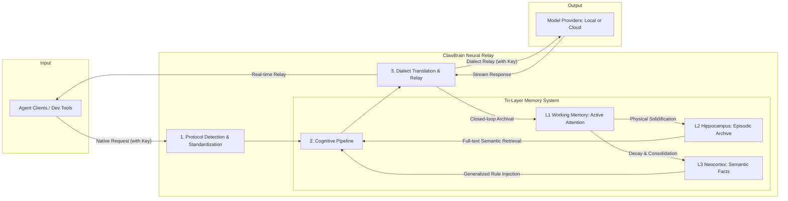

# 🦞 ClawBrain: The Silicon Hippocampus for your Agentic Workflow

English | [中文版](./README_CN.md)

<p align="center">
  
</p>

ClawBrain is the **infrastructure-layer memory engine for [OpenClaw](https://github.com/openclaw/openclaw)**. It sits between OpenClaw and its LLM backend as a transparent relay — capturing every interaction automatically, distilling it into persistent knowledge, and injecting the right context at the right time. All without touching OpenClaw's config or code.

---

## Why ClawBrain, When OpenClaw Already Has Memory?

OpenClaw ships with a thoughtful memory system: `MEMORY.md` for long-term facts, daily note files for recent context, hybrid FTS5 + vector search, and an experimental Dreaming pass that promotes daily notes to long-term storage. It is genuinely well-designed.

But there are four structural limitations that ClawBrain addresses at the infrastructure level.

### 1. Memory depends on the model deciding to write it

OpenClaw's memory is **write-on-demand**. The model must notice something is worth remembering, choose to call `memory_write`, and phrase it correctly. Under load, context pressure, or a fast-moving conversation, it skips this step. Important decisions, stated preferences, and resolved problems silently disappear.

ClawBrain captures **every interaction** at the wire level — no model decision required. Nothing is left to discretion.

### 2. `MEMORY.md` is injected on every turn — and it grows

OpenClaw injects `MEMORY.md` into the system prompt at the start of every session. This is the right design choice for OpenClaw, but it has a compounding cost: as the file grows, it consumes more tokens on every turn, increases compaction frequency, and raises API costs. OpenClaw itself warns: *"Keep MEMORY.md concise — it can grow over time and lead to unexpectedly high context usage."*

ClawBrain operates on a **greedy context budget** (L3 → L2 → L1, default 2000 chars). It injects only what is relevant to the current query — not the entire memory file. The full archive lives in SQLite and is retrieved on demand.

### 3. Semantic search requires a cloud embedding API key

OpenClaw's vector search is excellent when configured, but it requires an API key from OpenAI, Gemini, Voyage, or Mistral. Without one, only keyword FTS5 search is available. For users running fully local setups (Ollama, LM Studio), this means degraded recall.

ClawBrain's two-level FTS5 search (exact phrase → keyword AND fallback) works entirely offline. No embedding API. No cloud dependency. Local-first by design.

### 4. Dreaming is experimental and opt-in

OpenClaw's Dreaming feature — which promotes short-term daily notes to long-term `MEMORY.md` — is disabled by default, requires explicit configuration, and is labelled experimental. Most users never enable it.

ClawBrain's Neocortex distillation runs automatically in the background. Every N interactions, a background task consolidates recent traces into a persistent semantic summary — always on, no configuration required.

---

## Two Integration Modes

ClawBrain can plug into OpenClaw in two ways. Choose one or run both.

| | Mode A — HTTP Relay | Mode B — Context Engine Plugin |
|---|---|---|
| **How** | Transparent proxy in front of the LLM | Native OpenClaw plugin via internal API |
| **Setup** | Change one URL in OpenClaw config | Install plugin + two config lines |
| **Memory injection** | Injected as a `[IMPORTANT]` system message on every relay request | Injected as `systemPromptAddition` before each model run |
| **Session tracking** | Via `x-clawbrain-session` header | Via OpenClaw's native `sessionId` |
| **Works with all LLM backends** | Yes | Yes |
| **OpenClaw-native lifecycle hooks** | No | Yes (`ingest/assemble/compact/afterTurn`) |

Both modes use the same tri-layer memory backend. Mode B gives tighter integration with OpenClaw's session lifecycle.

---

## 🚀 Quick Start (Docker)

```bash
git clone https://github.com/winnerineast/ClawBrain.git
cd ClawBrain
cp .env.example .env        # configure env vars
docker compose up -d        # start on port 11435
curl http://localhost:11435/health
```

---

## 🔌 OpenClaw Integration

### Mode A — HTTP Relay (zero-config)

Point OpenClaw's model endpoint at ClawBrain instead of the LLM directly.
ClawBrain intercepts every request, enriches it with memory, and forwards to
the real backend.

```
OpenClaw  →  ClawBrain (port 11435)  →  Ollama / OpenAI / Claude / Gemini
                    │
         ┌──────────┴──────────┐
         │   On every request  │
         │  1. Archive trace   │  ← captures interaction automatically
         │  2. Search memory   │  ← FTS5 recall scoped to this session
         │  3. Inject context  │  ← greedy budget, highest-value facts first
         └─────────────────────┘
```

In your OpenClaw provider config, change the `baseUrl` to ClawBrain:

```json
"ollama": {
  "baseUrl": "http://127.0.0.1:11435",
  "apiKey": "sk-xxx..."
}
```

Set a session header so memory is isolated per user/project:

```
x-clawbrain-session: my-project
```

That's it. No other changes required.

---

### Mode B — Context Engine Plugin (OpenClaw-native)

ClawBrain implements OpenClaw's [Context Engine plugin interface](https://github.com/openclaw/openclaw).
In this mode, OpenClaw calls ClawBrain's `ingest/assemble/compact/afterTurn`
lifecycle hooks directly — giving ClawBrain precise control over what gets
injected, and when.

**Step 1 — Start ClawBrain**

```bash
docker compose up -d
# or locally:
PYTHONPATH=. uvicorn src.main:app --host 0.0.0.0 --port 11435
```

**Step 2 — Install the plugin**

```bash
# From a local clone:
openclaw plugins install -l ./packages/openclaw

# Or build first if dist/ is missing:
cd packages/openclaw && npm install && npm run build
cd ../..
openclaw plugins install -l ./packages/openclaw
```

**Step 3 — Configure `~/.openclaw/openclaw.json`**

```json5
{
  plugins: {
    slots: {
      contextEngine: "clawbrain"   // ClawBrain owns assembly + compaction
    },
    entries: {
      clawbrain: {
        enabled: true,
        // Optional overrides:
        // config: { url: "http://localhost:11435" }
      }
    },
    load: {
      paths: ["./packages/openclaw/dist/index.js"]
    }
  }
}
```

**Step 4 — Restart the OpenClaw gateway**

```bash
openclaw restart
# or kill and relaunch
```

**Verify the plugin is active:**

```bash
openclaw doctor
# should show: contextEngine → clawbrain
```

#### What happens after activation

| Hook | When OpenClaw calls it | What ClawBrain does |
|------|------------------------|---------------------|
| `ingest` | Every new message | Archives to Hippocampus, updates Working Memory |
| `assemble` | Before each model run | Retrieves L3→L2→L1 context, injects as `systemPromptAddition` |
| `compact` | Context window full / `/compact` | Distils traces into Neocortex, prunes Working Memory |
| `afterTurn` | After model run completes | Persists WM snapshot, optionally triggers background distillation |

ClawBrain sets `ownsCompaction: true` — OpenClaw's built-in auto-compaction is
disabled in favour of ClawBrain's SQLite-backed distillation.

#### Environment variables (plugin)

| Variable | Default | Description |
|----------|---------|-------------|
| `CLAWBRAIN_URL` | `http://localhost:11435` | ClawBrain server URL (read by the plugin) |
| `CLAWBRAIN_TIMEOUT_MS` | `5000` | Per-request timeout in ms |

---

### Running both modes together

Both modes are independent. You can run the HTTP relay for generic LLM traffic
and enable the Context Engine plugin for OpenClaw sessions simultaneously —
they share the same server and the same memory store.

---

## 🏗️ Architecture: The Neural Lifecycle



---

## 🧠 Tri-Layer Memory Dynamics

### L1 — Working Memory (Active Attention)
- **Implementation**: In-memory Weighted OrderedDict, **per-session isolated**
- **Attractor dynamics**: New input recharges relevant old memories (weight → 1.0); irrelevant items decay exponentially below threshold 0.3 and are evicted
- **Session isolation**: Each `x-clawbrain-session` header value gets its own independent WM instance; cross-session leakage is impossible

### L2 — Hippocampus (Episodic Archive)
- **Implementation**: SQLite FTS5 + local Blob storage, **per-session filtered**
- **Two-level search**: Exact phrase match first; keyword AND fallback if no results
- **Dynamic offloading**: Payloads > 512 KB streamed to `data/blobs/`; index keeps the anchor
- **Integrity**: SHA-256 checksum bound to every trace — tamper-proof and 100% traceable
- **Auto-cleanup**: Startup purges `timestamp=0.0` dirty records, TTL-expired traces, and orphan blob files

### L3 — Neocortex (Semantic Facts)
- **Implementation**: Async distillation engine (LLM-powered background task)
- **Trigger**: When Hippocampus accumulates `distill_threshold` traces (default 50), a background worker distills fragments into a persistent fact summary
- **Recommended formula**: `distill_threshold ≈ (ContextWindow / AvgTraceSize) × 0.8`
- **Context budget**: Greedy L3 → L2 → L1 priority; total chars capped by `CLAWBRAIN_MAX_CONTEXT_CHARS`

---

## 🔄 Protocol & Provider Support

ClawBrain's universal dialect translator handles 100% of provider API differences automatically:

| Category | Providers |
|----------|-----------|
| **Local** | Ollama, LM Studio, vLLM, SGLang |
| **Cloud** | OpenAI, DeepSeek, Anthropic (Claude), Google (Gemini), xAI (Grok), Mistral, OpenRouter |

Auto-handled quirks: role merging (Anthropic), role mapping (Gemini), non-destructive model prefix stripping, tool-call tier blocking for small models.

---

## 🔐 Session Isolation

Every request is scoped to a session via a single HTTP header:

```
x-clawbrain-session: alice
```

- Working Memory (L1), Hippocampus search (L2), and context retrieval are all strictly isolated per session
- Without the header, all traffic falls into `"default"` — a warning is logged
- Session state survives server restarts via Hippocampus hydration

---

## 🛠️ Management API

```bash
# Inspect a session's memory state
GET /v1/memory/{session_id}

# Clear a session's Neocortex summary
DELETE /v1/memory/{session_id}

# Manually trigger Neocortex distillation for a session
POST /v1/memory/{session_id}/distill

# Health check
GET /health
```

---

## ⚙️ Configuration

All runtime parameters are injected via environment variables (set in `.env`):

| Variable | Default | Description |
|----------|---------|-------------|
| `CLAWBRAIN_DB_DIR` | `/app/data` | SQLite DB and blobs directory |
| `CLAWBRAIN_MAX_CONTEXT_CHARS` | `2000` | Total context budget (chars) injected per request |
| `CLAWBRAIN_TRACE_TTL_DAYS` | `30` | Trace expiry in days (`0` = disabled) |
| `CLAWBRAIN_EXTRA_PROVIDERS` | _(empty)_ | JSON string to inject additional providers at runtime |
| `CLAWBRAIN_LOCAL_MODELS` | _(empty)_ | JSON string to whitelist additional local model IDs |

**Dynamic provider injection example:**
```bash
CLAWBRAIN_EXTRA_PROVIDERS='{"myprovider": {"base_url": "http://192.168.1.10:8080", "protocol": "openai"}}'
```

---

## 🐳 Docker Deployment

```bash
docker compose up -d          # start
docker compose logs -f        # live logs
docker compose down           # stop (data persists in ./data)
```

The `./data` directory is mounted as a volume — SQLite DB and blob files survive container restarts and upgrades.

> **Note**: ClawBrain runs with `--workers 1` by default. Working Memory is in-process; horizontal scaling requires migrating L1 to an external store (e.g., Redis).

---

## 🖥️ Local Development

```bash
python3 -m venv venv && source venv/bin/activate
pip install -r requirements.txt
# Start with PYTHONPATH=. to ensure local modules are found
PYTHONPATH=. ./venv/bin/python3 -m uvicorn src.main:app --host 0.0.0.0 --port 11435 --reload

# Run full test suite
PYTHONPATH=. ./venv/bin/pytest tests/ --ignore=tests/test_p10_auto_trigger.py -v
```

> `test_p10_auto_trigger.py` requires a live LLM (Ollama) for distillation — skip it in CI without a local model.

---

## 🛡️ Privacy & Security

ClawBrain adheres to the **"No-Shadow Principle"**:
- **Zero-Knowledge**: API keys are never recorded, saved, or persisted — held in volatile memory for instantaneous transit only
- **Transparent Relay**: Auth info is destroyed immediately upon request completion
- **Local Storage**: All memory artifacts (Hippocampus traces, Neocortex summaries) are stored exclusively in your local `data/` directory — never uploaded to any cloud

---

## 🧪 Audit Philosophy

The project follows the **GEMINI.md** constitution: design docs updated before code, every phase produces Side-by-Side audit evidence in `results/`.

Structured log tags emitted at runtime:

| Tag | Layer |
|-----|-------|
| `[DETECTOR]` | Protocol detection |
| `[PIPELINE]` | Cognitive pipeline |
| `[MODEL_QUAL]` | Tier classification & tool-call gating |
| `[HP_STOR]` | Hippocampus archival |
| `[HP_CLEAN]` | TTL / dirty-data cleanup |
| `[CTX_BUDGET]` | L3→L2→L1 budget allocation |
| `[NC_DIST]` | Neocortex distillation |
| `[SESSION]` | Session header warnings |

---

<p align="right">Generated by Claude Sonnet 4.6 based on source v1.40 (P24)</p>
