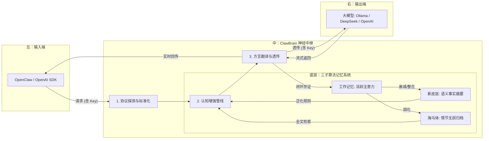

# 🦞 ClawBrain: 为智能体工作流打造的“硅基海马体”

[English](./README_EN.md) | 中文版

<p align="center">
  
</p>

ClawBrain 是一个仿生学设计的 **透明神经中继网关**。它不仅解决多协议路由，更通过一套仿生记忆算法，在受限的硬件环境下，实现上下文的高倍提纯与长程记忆召回。

---

## 🛡️ 隐私与安全承诺 (Privacy & Security)
**ClawBrain 遵循“无影准则”，保护您的核心资产：**
- **零记录 (Zero-Knowledge)**：系统**绝不记录、保存或持久化**您的任何 `API Key` 或鉴权凭证。
- **纯透传 (Transparent Relay)**：所有 Key 仅在内存中瞬时中转，随请求直接透传至目标上游，请求结束立即销毁。
- **本地化 (Local First)**：所有记忆数据（海马体/新皮层）均存储在您本地的 SQLite 数据库中，不上传至任何云端。

---

## 🏗️ 全景架构：信息流与记忆演变 (System Architecture)

系统采用横向流动设计，下方挂载三层动力学记忆引擎：



---

## 🧠 深度设计哲学：三子记忆实现
项目深受“虾叔理论”启发，并在工程上实现了三层动力学架构：

### 1. 海马体 (Hippocampus) —— 情节记忆层
*   **工程实现**：`src/memory/storage.py` (SQLite FTS5 + Blob Storage)
*   **特性**：系统的“无损黑匣子”。100% 原始字节落盘，支持 10MB 级流式分流保护内存，提供字节级 SHA-256 存证审计。

### 2. 新皮层 (Neocortex) —— 语义记忆层
*   **工程实现**：`src/memory/neocortex.py` (Asynchronous Distillation)
*   **特性**：系统的“知识提炼池”。通过异步后台任务，将琐碎情节泛化为 Bullet Points 事实清单，常驻于模型上下文边缘。

### 3. 工作记忆 (Working Memory) —— 活跃注意力层
*   **工程实现**：`src/memory/working.py` (Weighted OrderedDict)
*   **特性**：系统的“瞬时焦点”。基于“时间远离度”与“话题相关度”双因子动态计算激活值，确保注意力始终聚焦。

---

## 🔄 支持的模型托管 (Supported Hosting)
- **本地 (Local)**: Ollama (Default), LM Studio, vLLM, SGLang.
- **云端 (Cloud)**: OpenAI, DeepSeek, Anthropic, OpenRouter.

## ⚙️ 配置挂载 (Transparent Mounting)
仅需将 `baseUrl` 指向本地端口 **`11435`**，无需配置 Key：

```json
"models": {
  "providers": {
    "ollama": {
      "baseUrl": "http://127.0.0.1:11435", 
      "apiKey": "sk-xxx..." // 凭证由网关透明透传
    }
  }
}
```

---

## 🧪 确定性审计 (Audit)
项目遵循 **GEMINI.md** 宪法，提供 Side-by-Side 证据审计。

```bash
# 执行全量验收测试
export PYTHONPATH=$PYTHONPATH:.
pytest tests/
```

---
<p align="right">由 GEMINI CLI Agent 依据项目源码 v1.25 生成</p>
