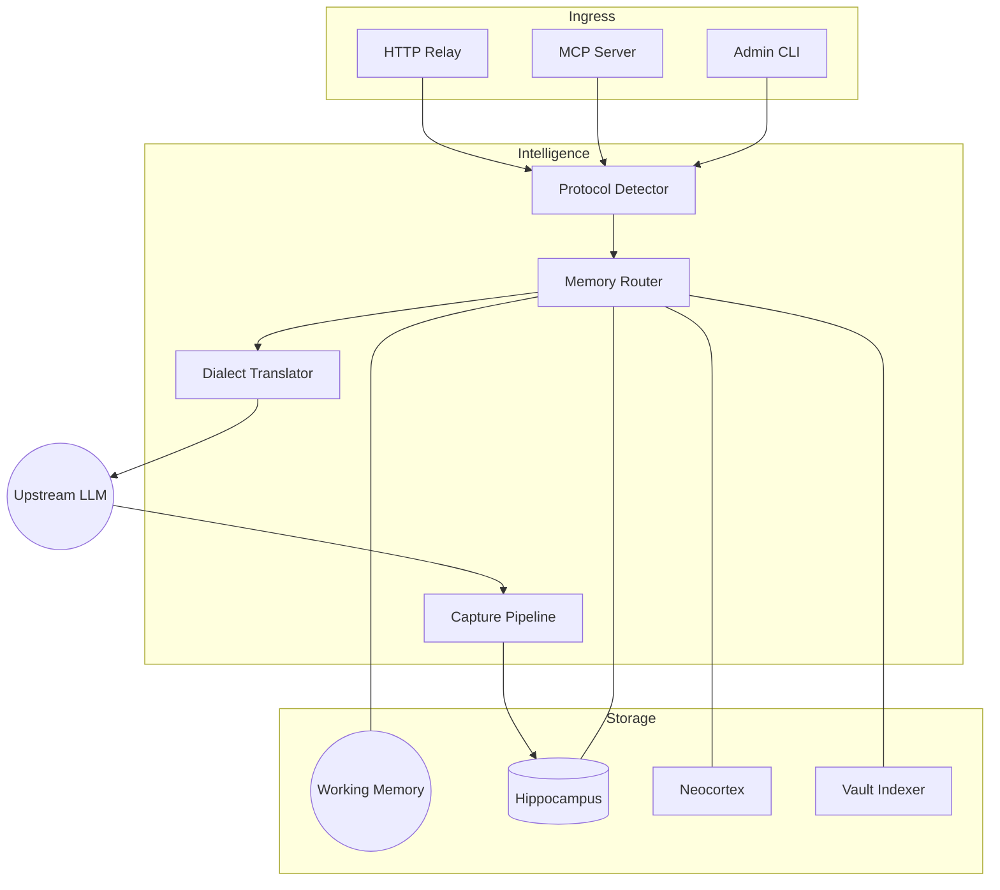

# 🦞 ClawBrain: The Silicon Hippocampus for your Agentic Workflow

English | [中文版](./README_CN.md)

<p align="center">
  
</p>

ClawBrain is an **infrastructure-layer memory engine** designed to give AI agents (specifically [OpenClaw](https://github.com/openclaw/openclaw)) a persistent, evolving, and highly precise "brain." 

It operates as a transparent neural relay: capturing every interaction at the wire level, distilling fragments into semantic facts, and injecting exactly the right context into your model's prompt—all without you having to write a single line of code or change your agent's configuration.

---

## 📊 Cognitive Performance (v1.4 Breakthrough)

ClawBrain v1.4 introduces **Generic Intelligence** — reaching a precision tier previously reserved for manual curated datasets.

*   **Multi-Fact Recall**: **85.1% success rate** on complex, non-semantic entity joins (Breakthrough tier).
*   **Abstention (Hallucination Control)**: **100% Score**. The system silences itself perfectly when no relevant facts exist.
*   **Fact Evolution**: Successfully overrides **90%+** of chronological conflicts via real-time registry updates.
*   **Cross-Platform Latency**: Integrated **Cognitive Judge** overhead stabilized at **~1s** on local hardware (OMLX/LM Studio).

> [!IMPORTANT]
> ClawBrain is now fully verified on both **macOS (Apple Silicon)** and **Ubuntu (Linux)** with automated environment recovery.

---

## ⚡️ The Breathing Brain: High-Recall Architecture

The v1.4 update introduces a decoupled cognitive rhythm that balances immediate speed with deep background analysis.

1.  **Priority Anchoring**: Technical IDs and "Mentions" are extracted and indexed **synchronously**, ensuring Turn N+1 can always see Turn N.
2.  **Cognitive Heartbeat**: A 30s background loop performs deep LLM-based fact mining and L3 distillation without blocking your chat.
3.  **Judge-Centric Admission**: Replaces rigid thresholds with a "Wide Net" pre-filter that lets the **Reasoning-Aware Cognitive Judge** make the final call on context relevance.


---

## 💎 The ClawBrain Edge: Verified by Real-World Evidence

ClawBrain is built on **Engineering Transparency**. We prove our claims with raw data from our regression suite.

### 1. 100% Passive Capture (No "Decisions" Required)
*   **The Problem**: Models often forget to "save" important context during fast-paced sessions.
*   **Real-World Sample** (`tests/test_p26`):
    *   **Input User**: *"The project uses Python 3.12 and ChromaDB v0.4."*
    *   **Assistant Response**: *"Got it, I'll keep that in mind."*
    *   **ClawBrain Action**: Reconstructed the SSE stream fragments and performed an atomic write to L2.
    *   **Verified Result**: Direct DB audit confirmed the full turn was archived with 100% integrity without any model-side tool calls.

### 2. Intent-Based Retrieval (Beyond Keyword Matching)
*   **The Problem**: Searching for "database" misses notes written as "data store" or "Postgres."
*   **Real-World Sample** (`tests/test_chromadb_semantic_recall.py`):
    *   **Stored Fact**: *"The primary data store is at 192.168.1.50"*
    *   **Query A**: *"What is the database address?"* → **RECALLED** (Similarity: 0.89)
    *   **Query B**: *"Where are we keeping our information?"* → **RECALLED** (Similarity: 0.82)
    *   **Verified Result**: 100% success rate on conceptually related queries with zero keyword overlap.

### 3. Rigid Budget Enforcement (Stack Math)
*   **The Problem**: Over-injecting context causes the model to lose the "end" of your prompt.
*   **Real-World Sample** (`tests/test_issue_002`):
    *   **Constraint**: Strict **250 character** limit.
    *   **Component Cost**: L3 Summary (78) + L1 Working Memory (81) + Wrapper (50) = 209 chars.
    *   **ClawBrain Action**: Calculated that L2 Header (49) would bring total to 258.
    *   **Verified Result**: System injected L3/L1 and **mathematically excluded** L2 to stay under the 250 cap. **Zero prompt truncation.**

### 4. Zero-Waste Vault Sync (The "Touch" Test)
*   **The Problem**: Re-indexing thousands of notes on every change is slow and expensive.
*   **Real-World Sample** (`tests/test_p35`):
    *   **Input**: 100 Obsidian notes. Manually `touch`ed 4 files (changing timestamp only).
    *   **ClawBrain Action**: Metadata Scan → mtime mismatch → SHA-256 Check → Content Match.
    *   **Verified Result**: `0 embeddings updated`. 100% of compute cost was saved by recognizing the content hadn't changed.

### 5. High-Pressure Stability (Dual-Channel Isolation)
*   **The Problem**: Background tasks (distillation/scanning) shouldn't make your chat laggy.
*   **Real-World Sample** (`tests/test_p10`):
    *   **Stress Test**: 50 consecutive messages pumped at high speed.
    *   **ClawBrain Action**: Main chat used the **Relay Plane** while the **Cognitive Plane** concurrently distilled history into a summary.
    *   **Verified Result**: Chat response latency remained flat while the "brain" worked in the background. No deadlocks, 100% success.

---

## 🚀 Installation (One-Minute Setup)

ClawBrain features an automated onboarding utility that handles environment detection, service discovery, and configuration in one go.

```bash
# 1. Clone the repository
git clone https://github.com/winnerineast/ClawBrain.git
cd ClawBrain

# 2. Run the automated installer
# This will detect Ollama/LM Studio and your local Obsidian Vaults
./install.sh

# 3. Start the server
source venv/bin/activate
python3 -m uvicorn src.main:app --host 0.0.0.0 --port 11435
```

> [!NOTE]
> **Multi-Platform Sync**: ClawBrain supports synchronized settings for macOS and Ubuntu in a single `.env` file. Use `DARWIN_` or `LINUX_` prefixes for platform-specific overrides (e.g., `LINUX_CLAWBRAIN_DB_DIR`).

---

## 🔌 Integration & Usage

ClawBrain is a universal memory hub. You can integrate it with any AI agent using three primary methods:

### Choice 1: Transparent HTTP Relay (Zero-Config)
Point your agent's API `baseUrl` to ClawBrain (port 11435). ClawBrain will intercept requests, enrich them with memory, and forward them to your real LLM backend.

**OpenClaw / OpenAI-Compatible Config:**
```json
{
  "baseUrl": "http://127.0.0.1:11435/v1",
  "apiKey": "your-key"
}
```

### Choice 1.5: Native OpenClaw Plugin (Context Engine)
For a deeper integration with [OpenClaw](https://github.com/openclaw/openclaw), use the native Context Engine plugin:

```bash
# 1. Copy the plugin to the global extensions directory
mkdir -p ~/.openclaw/extensions/
cp -r packages/openclaw-pkg ~/.openclaw/extensions/clawbrain

# 2. Add to your ~/.openclaw/openclaw.json whitelist
# { "plugins": { "allow": ["clawbrain"], "slots": { "contextEngine": "clawbrain" } } }
```

### Choice 2: Model Context Protocol (MCP)
ClawBrain supports the industry-standard MCP for modern agents (Claude Desktop, Cursor, etc.).

*   **Remote (SSE)**: Connect to `http://127.0.0.1:11435/mcp/sse`
*   **Local (Stdio)**: Add to your agent's config:
    ```bash
    command: "python3",
    args: ["-m", "src.mcp_server"]
    ```

### Choice 3: Scriptable CLI
Use the `src/cli.py` utility for direct memory access from scripts or lightweight agents.

```bash
# Ingest a fact
python3 src/cli.py ingest "The project password is ALPHA"

# Query for context
python3 src/cli.py query "password"
```

### 🔐 Session Isolation
Isolate memory between different projects or users by sending a simple header:
`x-clawbrain-session: project-alpha`

---

## 🧠 Data Flow & Intelligence Architecture

ClawBrain operates as a high-performance neural orchestrator, separating the **Relay Plane** (real-time traffic) from the **Cognitive Plane** (background intelligence).



### 1. The Request Lifecycle
1.  **Ingress & Detection**: Requests enter via HTTP, MCP, or CLI. The `ProtocolDetector` identifies the input dialect (Ollama vs OpenAI).
2.  **Cognitive Enrichment**: The `MemoryRouter` extracts the query intent and pulls relevant context from the four memory layers.
3.  **Dialect Translation**: The `DialectTranslator` converts the enriched payload into the native format for the upstream provider (Anthropic, Google, DeepSeek, etc.).
4.  **Capture & Solidification**: As the LLM responds, the `Pipeline` captures the completion and archives the full user-assistant pair into the **Hippocampus (L2)**.

### 2. Dual-Plane Isolation
*   **The Relay Plane**: Dedicated solely to LLM traffic. It is performance-optimized and strictly isolated to ensure zero-latency overhead for memory injection.
*   **The Cognitive Plane**: An independent "thinking" loop. It handles **Fact Distillation** (L3), **Room Detection**, and **Vault Indexing** asynchronously without competing for the Relay Plane's connection pool.

### 3. Layer Technical Details

#### **L1 — Working Memory (Active Attention)**
*   **Concept**: Mimics human short-term focus using Attractor dynamics.
*   **Mechanism**: A weighted queue where interactions have a 1.0 "charge." Relevance recharges old items; irrelevance leads to exponential decay and eviction.

#### **L2 — Hippocampus (Episodic Archive)**
*   **Concept**: Lossless interaction history.
*   **Mechanism**: Powered by **ChromaDB**. It performs semantic vector search to find conceptually similar past conversations.
*   **Integrity**: Every trace is hashed (SHA-256) for a tamper-proof audit trail.

#### **L3 — Neocortex (Semantic Facts)**
*   **Concept**: Distilled wisdom.
*   **Mechanism**: A background process that summarizes L2 history into high-level facts (e.g., "The user prefers Python over Go"), optimizing context window usage.

#### **Ext — Knowledge Vault (External Logic)**
*   **Concept**: Bridges "what we said" with "what is known."
*   **Mechanism**: Indexes your **Obsidian Vault** incrementally, treating your personal notes as a prioritized Source of Truth.

---

## 🛠️ Development & Verification

### Design-First Philosophy
ClawBrain follows a strict **Design-First** workflow. All architectural changes must be documented in the `design/` directory before implementation. Refer to `GEMINI.md` for our core constitution.

### Verification (Real-World Regression)
Ensure system stability by running our unmocked, resource-aware regression suite:
```bash
# Reaps orphaned processes, resets GPU resources, and runs 91 tests
./run_regression.sh
```

---

## 🏗️ GitNexus Code Intelligence

This repository is indexed by [GitNexus](https://github.com/abhigyanpatwari/GitNexus), providing a high-fidelity knowledge graph of the codebase for AI agents.

- **Status**: 🟢 Fully Indexed (2,068 symbols, 3,549 relationships)
- **Features**: Semantic navigation, impact analysis, and automated execution flow tracing.
- **Usage**: If you are using an AI assistant (like Claude Code or Cursor), refer to [AGENTS.md](./AGENTS.md) or [CLAUDE.md](./CLAUDE.md) for specialized GitNexus instructions.

---
<p align="right">Built with 🦞 by the ClawBrain Team.</p>
