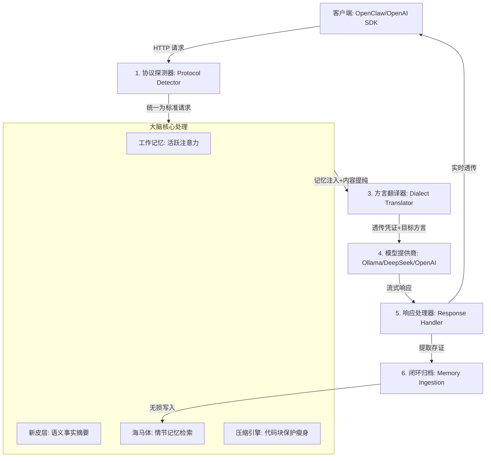

# 🦞 ClawBrain: 你的智能体工作流“硅基海马体”

[English](./README_EN.md) | 中文版

<p align="center">
  
</p>

ClawBrain 是一个仿生学设计的 **透明神经中继网关**。它不仅是多协议转换器，更是 LLM 的“外挂大脑”。通过将每一轮对话流经“海马体”与“新皮层”，它赋予了普通模型超越上下文限制的长效记忆与精准执行力。

---

## 🏗️ 系统架构：神经交互生命周期 (System Architecture)

ClawBrain 的核心是一个高度解耦的流水线，确保每一次请求都经过深度认知增强：



---

## 🧠 深度设计概念 (Design Concepts)

### 1. 动态协议探测 (Protocol Ingress)
系统不再要求用户手动指定协议类型。网关会自动根据请求路径（`/api` 或 `/v1`）以及 Payload 的结构指纹，自动判定源协议是 **Ollama 原生** 还是 **OpenAI 兼容**。

### 2. 神经增强管线 (Cognitive Pipeline)
在转发给模型前，ClawBrain 会执行三位一体的增强：
- **记忆合成**：将当前问题与海马体中的历史情节、新皮层的泛化知识进行动态拼接。
- **权重激活**：基于“时间”与“话题”双因子，让最相关的历史信息自动浮现到 Context 顶部。
- **物理瘦身**：在不破坏代码块 (` ``` `) 缩进的前提下，剔除 15% 以上的文本底噪。

### 3. 透明方言翻译 (Dialect Egress)
这是实现“万能接口”的关键。网关将标准化的请求“翻译”成目标后端（如 Anthropic 或 DeepSeek）认可的特定 JSON 结构，并实现 **NDJSON 与 SSE 之间的双向流式转换**。

---

## ⚙️ 挂载指南：零配置透传 (Transparent Mounting)

ClawBrain 采用 **“凭证直通”** 架构。你无需在网关侧配置任何 API Key。

### 客户端接入 (以 OpenClaw 为例)
仅需将 `baseUrl` 修改为 ClawBrain 地址，其余配置（包括真实的 sk-key）保持原样：

```json
"ollama": {
  "baseUrl": "http://127.0.0.1:11435", // 路由至神经网关
  "api": "ollama",
  "apiKey": "sk-xxx..." // 凭证将由网关透明透传至上游
}
```

### 模型路由前缀
通过模型名前缀动态选择上游，网关会自动映射真实后端：
- `ollama/gemma4` $\rightarrow$ 路由至本地 11434 端口。
- `lmstudio/llama3` $\rightarrow$ 路由至本地 1234 端口。
- `openai/gpt-4o` $\rightarrow$ 路由至 api.openai.com。

---

## 🧪 确定性验收
项目遵循 **GEMINI.md** 法典，全量 E2E 测试均提供 Side-by-Side 证据。

```bash
# 执行全链路集成验收
pytest tests/test_p11_integration.py
```

---
<p align="right">由 GEMINI CLI Agent v1.25 驱动生成</p>
