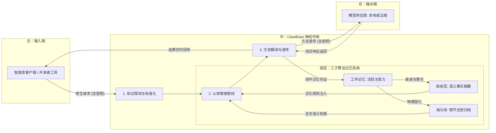

# 🦞 ClawBrain: 智能体工作流的“硅基海马体”

[English](./README_EN.md) | 中文版

<p align="center">
  
</p>

ClawBrain 是一个基于仿生学设计的 **透明神经中继网关**。它不仅解决了多协议路由的兼容性问题，更通过模拟人类大脑的记忆演变逻辑，为大语言模型（LLM）提供了一个能够自我进化、具备长短期记忆协同的“外挂大脑”。在受限的显存硬件环境下，ClawBrain 能显著提升智能体的上下文利用效率与任务执行的逻辑一致性。

---

## 🛡️ 隐私与安全承诺
**ClawBrain 遵循“无影准则”，保护您的核心数字资产：**
- **零记录政策**：系统核心逻辑中**严禁记录、保存或持久化**您的任何接口密钥或鉴权凭证。
- **透明透传架构**：所有的身份验证信息仅在内存中进行瞬时中转，随请求直接透传至目标上游，一旦请求处理完成，内存即刻释放销毁。
- **本地化存储**：所有的记忆产物（海马体的情节记录、新皮层的语义事实）均完全存储在您本地的数据库中，绝不上传至任何第三方云端。

---

## 🏗️ 全景架构：信息流与记忆演变

系统采用横向流动设计，下方挂载三层深度动力学记忆引擎，确保每一次交互都经过神经增强：



---

## 🧠 深度设计哲学：三子记忆的演变算法

ClawBrain 的核心并非静态的数据库，而是信息在不同能级之间流动的 **“相变”** 过程。每一个交互对（刺激-反应）都会在系统中经历从瞬间激活到长效固化的演变：

### 1. 工作记忆 (L1: 活跃注意力层)
*   **工程实现**：内存中带权重的有序字典（Weighted OrderedDict）。
*   **演变逻辑**：
    - **初始激活**：每组新交互进入时，获得满额电荷（权重为 1.0）。
    - **吸引子动力学**：系统会持续扫描当前话题。如果新输入的内容与旧记忆高度相关，相关的旧记忆会被重新“充电”，在注意力中心驻留更久。
    - **自然衰减**：不相关的信息随时间呈指数级衰减。当权重低于 0.3 阈值时，信息从“瞬时意识”中消失，其索引将被挤出至新皮层进行泛化处理。

### 2. 海马体 (L2: 情节归档层)
*   **工程实现**：SQLite 全文检索引擎（FTS5）与本地二进制存储（Blob Storage）。
*   **演变逻辑**：
    - **数字化底片**：系统将每一轮对话的原始字节进行 100% 无损落盘。
    - **冲击防御**：面对巨量数据（如 10MB 级的合同或超长日志），海马体会自动开启流式分流模式，确保内存波动平稳，并在索引中精准标记记忆锚点。
    - **完整性审计**：每一条情节记忆都绑定了 SHA-256 校验和，确保历史记录的真实性与可回溯性。

### 3. 新皮层 (L3: 语义事实层)
*   **工程实现**：后台异步语义提纯引擎（Asynchronous Distillation）。
*   **核心参数：语义整合周期 (`distill_threshold`)**：
    - **物理意义**：该参数定义了从“琐碎情节”转向“核心知识”的临界点。它代表了系统愿意忍受多少冗余信息，才去进行一次昂贵的逻辑抽象。
    - **自动进化**：当海马体中积累的对话轮数达到此阈值时，系统会自动启动后台任务，将碎片泛化为固化的事实清单。
    - **推荐算法**：该值应与模型的 **上下文窗口 (Context Window)** 负相关。
        - **计算公式**：`distill_threshold ≈ (ContextWindow / AverageTraceSize) * 0.8`
        - **示例**：对于 64k 窗口模型，建议设为 **50**。若窗口仅为 8k，则应设为 **5-10**，以实现更频繁的“排空提纯”。
*   **演变逻辑**：
    - **异步提纯**：当海马体中的琐碎情节积累到一定阈值，后台任务会自动启动。
    - **泛化提取**：利用模型的慢速累积效应，将反复出现的技术决策或用户偏好提炼为“事实清单”。
    - **长程常驻**：提纯后的知识点会以极简的格式，常驻在模型上下文的边缘，提供跨越周期的逻辑指导，彻底解决模型“断片”的问题。

---

## 🔄 协议翻译与模型适配
ClawBrain 内置了强大的万能方言翻译器，能够根据不同提供商的 API 契约自动对齐，实现 100% 兼容：
- **本地环境**：深度适配 Ollama, LM Studio, vLLM, SGLang。
- **云端环境**：支持 OpenAI, DeepSeek, Anthropic (Claude 3.5), Google (Gemini), xAI (Grok), Mistral 等。
- **自动对齐**：自动处理角色合并（解决 Claude 报错）、角色映射（适配 Gemini）以及模型前缀剥离。

---

## ⚙️ 挂载指南：零配置透传
仅需在客户端将地址指向本地端口 **`11435`**，无需在网关进行任何重复配置：

```json
"ollama": {
  "baseUrl": "http://127.0.0.1:11435", 
  "apiKey": "sk-xxx..." // 您的原始密钥将由网关安全透传
}
```

---

## 🧪 确定性审计与神经活动日志
项目遵循 **GEMINI.md** 宪法，提供全生命周期的 Side-by-Side 证据审计。
- **全链路埋点**：系统实时记录 `[DETECTOR]`、`[PIPELINE]`、`[MODEL_QUAL]`、`[ADAPTER]` 及 `[HP_STOR]` 标签，确保从协议探测到异步存储的每一项决策都透明可查。
- **异步日志确证**：通过增强的测试等待机制，确保即便是海马体的后台落盘动作也能被 100% 捕获存证。

```bash
# 执行全量验收测试并查看神经活动日志
export PYTHONPATH=$PYTHONPATH:.
pytest -v -s -o "log_cli=true" tests/
```

---
<p align="right">由 GEMINI CLI Agent 依据项目源码 v1.26 驱动生成</p>
