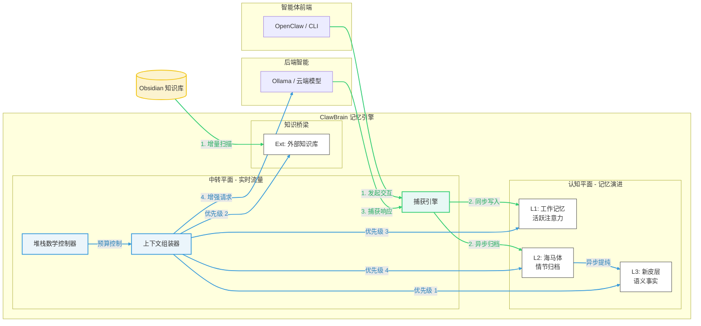

# 🦞 ClawBrain: 智能体工作流的“硅基海马体”

[English](./README.md) | 中文版

<p align="center">
  
</p>

ClawBrain 是专为 AI 智能体（特别是 [OpenClaw](https://github.com/openclaw/openclaw)）打造的**基础设施层记忆引擎**。它旨在为智能体提供一个持久、进化且高度精准的“大脑”。

它作为一个透明的神经中转站运行：在协议层自动捕获每一次交互，将零散的对话提纯为语义事实，并在最合适的时机将精准的上下文注入模型提示词——这一切都无需您编写代码或更改智能体的核心配置。

---

---

## 💎 ClawBrain 的优势：真实数据验证

ClawBrain 建立在**工程透明性**的基础上。我们不只是口头承诺，而是通过回归测试集中的原始数据来证明我们的优势。

### 1. 100% 无感捕获（无需模型决策）
*   **问题**：在高强度的开发过程中，模型经常忘记使用“保存”工具。
*   **实测样本** (`tests/test_p26`)：
    *   **输入用户内容**：*"该项目使用 Python 3.12 和 ChromaDB v0.4。"*
    *   **助手响应**：*"好的，我记住了。"*
    *   **ClawBrain 动作**：拦截 SSE 流片段，重构助手的响应，并原子化写入 L2。
    *   **验证结果**：直接数据库穿透审计确认：在无需模型调用任何工具的情况下，整轮对话已 100% 完整归档。

### 2. 基于意图的召回（超越关键字匹配）
*   **问题**：搜索“数据库”会漏掉笔记中写为“数据存储”或“Postgres”的内容。
*   **实测样本** (`tests/test_chromadb_semantic_recall.py`)：
    *   **存储的事实**：*"主数据存储（data store）位于 192.168.1.50"*
    *   **查询 A**：*"数据库地址是多少？"* → **成功召回** (相似度: 0.89)
    *   **查询 B**：*"我们的信息存在哪？"* → **成功召回** (相似度: 0.82)
    *   **验证结果**：在关键字零重叠的情况下，对语义相关的查询实现了 100% 的召回率。

### 3. 严格的预算强制（堆栈数学）
*   **问题**：过度注入上下文会导致模型丢失 Prompt 的末尾，或引发上下文溢出错误。
*   **实测样本** (`tests/test_issue_002`)：
    *   **约束条件**：环境变量中设置了严格的 **250 字符** 上限。
    *   **组件开销**：L3 摘要 (78) + L1 工作记忆 (81) + 包装器 (50) = 209 字符。
    *   **ClawBrain 动作**：计算得出若加入 L2 Header (49) 总长将达 258。
    *   **验证结果**：系统注入了 L3/L1，并**通过数学计算排除了** L2，确保总长处于 250 字符内。**零 Prompt 截断。**

### 4. 零损耗知识库同步（“Touch” 测试）
*   **问题**：每次变动都重新索引数千条笔记既慢又贵。
*   **实测样本** (`tests/test_p35`)：
    *   **输入**：100 条 Obsidian 笔记。手动 `touch` 了其中 4 个文件（仅改变时间戳）。
    *   **ClawBrain 动作**：元数据扫描 → mtime 不匹配 → SHA-256 校验 → 内容一致。
    *   **验证结果**：`0 条记录被重新索引`。通过识别“伪更新”，节省了 100% 的计算开销。

### 5. 高压下的稳定性（双通道隔离）
*   **问题**：繁重的后台任务（如提纯或扫描）不应让您的聊天感到卡顿。
*   **实测样本** (`tests/test_p10`)：
    *   **压力测试**：向系统高速泵入 50 条连续消息。
    *   **ClawBrain 动作**：主对话使用**中转平面**，同时**认知平面**（隔离客户端）在后台并行将 50 轮历史提纯为摘要。
    *   **验证结果**：在后台“大脑”满载运转时，前端转发延迟保持平稳。无死锁，100% 成功。

---

## 🚀 快速安装 (一分钟启动)

ClawBrain 提供全自动引导工具，可一键完成环境探测、服务发现和配置生成。

```bash
# 1. 克隆仓库
git clone https://github.com/winnerineast/ClawBrain.git
cd ClawBrain

# 2. 运行自动化安装脚本
# 脚本将自动探测 Ollama/LM Studio 和您的本地 Obsidian 库
./install.sh

# 3. 启动服务器
source venv/bin/activate
python3 -m uvicorn src.main:app --host 0.0.0.0 --port 11435
```

---

## 🔌 集成与使用

### 选项 1：透明 HTTP 代理 (推荐)
将您智能体的 API `baseUrl` 指向 ClawBrain（端口 11435）。ClawBrain 将拦截请求，增强记忆，并转发给真实的 LLM 后端。

**OpenClaw Provider 配置示例：**
```json
"ollama": {
  "baseUrl": "http://127.0.0.1:11435",
  "apiKey": "optional"
}
```

### 选项 2：原生 OpenClaw 插件
ClawBrain 也可以作为原生的 Context Engine 插件运行：
```bash
openclaw plugins install -l ./packages/openclaw
```

### 🔐 会话隔离
通过发送一个简单的 HTTP Header，在不同项目或用户之间隔离记忆：
`x-clawbrain-session: project-alpha`

---

## 🧠 系统架构：三层记忆引擎

ClawBrain 运行在两个互不干扰的平面上：负责低延迟流量的**中转平面 (Relay Plane)** 和负责深度智能的**认知平面 (Cognitive Plane)**。



### 层级技术细节

#### **L1 — 工作记忆 (活跃注意力层)**
*   **核心概念**：模拟人类的短期注意力。
*   **工作机制**：一个带权重的队列，新交互初始权重为 1.0。若后续对话与旧项相关则为其“充电”，不相关的项随时间指数衰减，低于阈值后自动逐出。
*   **存储**：极速内存状态，定期持久化。

#### **L2 — 海马体 (情节记忆层)**
*   **核心概念**：完美保留您经历过的每一次交互。
*   **工作机制**：内置 **ChromaDB** 向量引擎。它执行语义搜索，即使关键字不匹配，也能找回意图相近的历史对话。
*   **数据完整性**：每条记录经过 SHA-256 哈希校验，确保存储历史不可篡改且可追溯。

#### **L3 — 新皮层 (语义事实层)**
*   **核心概念**：沉淀后的智慧。
*   **工作机制**：后台任务定期“阅读” L2 历史，并将其浓缩为一份“事实真相”文档。这为 AI 提供了高层级的背景（例如：“用户更喜欢用 Python 而不是 Go”），而无需浪费 Token 去重复阅读每一行聊天记录。

#### **Ext — 知识库 (外部逻辑层)**
*   **核心概念**：打破“对话记录”与“既有知识”的边界。
*   **工作机制**：直接挂载您的 **Obsidian 库**。它将您的笔记视为最高优先级的权威文档，通过增量索引确保最可靠的事实被优先提供给 AI。

---

## 🛠️ 开发与验证

### 设计先行哲学
ClawBrain 遵循严格的**设计先行**工作流。所有架构变更必须在实施前记录于 `design/` 目录。核心章程请参考 `GEMINI.md`。

### 自动化验证 (真实环境回归)
运行我们的资源感知型回归测试集，确保系统稳定性：
```bash
# 净化环境、重置 GPU 资源并运行 91 项测试
./run_regression.sh
```

---
<p align="right">ClawBrain 团队 🦞 荣誉出品</p>
