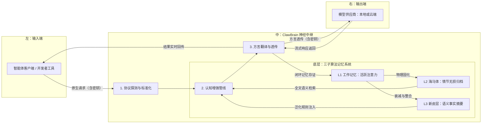

# 🦞 ClawBrain：智能体工作流的"硅基海马体"

[English](./README.md) | 中文版

<p align="center">
  
</p>

ClawBrain 是 **[OpenClaw](https://github.com/openclaw/openclaw) 的记忆增强层**。它以透明代理的方式拦截每一个 LLM 请求，将相关的长期记忆注入上下文，并归档每一次交互——让你的个人 AI 助手真正记住你是谁、你关心什么、上周发生了什么。

---

## 问题所在：OpenClaw 会遗忘

[OpenClaw](https://github.com/openclaw/openclaw) 是一款出色的个人 AI 助手框架。它将你的 WhatsApp、Telegram、Slack、Discord 等 20+ 渠道统一接入同一个智能体，体验流畅——直到你开始下一次对话。

**每次会话都从零开始。**

这不是 OpenClaw 的 bug，而是大语言模型的根本性约束：

| 约束 | 实际影响 |
|------|----------|
| **无状态设计** | LLM 对历史对话没有任何记忆，每次请求都是独立的 |
| **上下文窗口有限** | 即使把历史记录塞进 prompt，也会很快触及 token 上限——在本地小模型上尤为突出 |
| **跨渠道无法连续** | 你在 WhatsApp 提到了项目截止日，在 Telegram 追问进展——助手完全不知道这两件事有关联 |
| **重复解释的成本** | 每次新会话都要重新介绍你的偏好、技术栈、背景——浪费时间，打断节奏 |

结果是：你的 AI 助手拥有 GPT-4 级别的智能，却有金鱼般的记忆。

## 解决方案：ClawBrain

ClawBrain 作为**零配置透明代理**，插入 OpenClaw 与其 LLM 后端之间。OpenClaw 像往常一样把请求发往 `http://localhost:11435`，ClawBrain 在无感知的情况下拦截请求、注入相关记忆、转发请求、归档响应。

```
OpenClaw  →  ClawBrain（端口 11435）  →  Ollama / OpenAI / Claude / Gemini
                    ↑
          三层记忆引擎
          （记住一切）
```

你的助手从此能够：
- **调取数周前的事实**——项目名称、已做的决定、表达过的偏好
- **无需提示即可适应**——它已经了解你的技术栈、风格和上下文
- **跨渠道一致**——记忆按 session 隔离，但跨重启持久化
- **完全本地运行**——数据不离开你的设备

ClawBrain 不替代 OpenClaw 的智能，它赋予它一个**海马体**。

---

## 🚀 快速启动（Docker）

```bash
git clone https://github.com/winnerineast/ClawBrain.git
cd ClawBrain
cp .env.example .env        # 按需配置环境变量
docker compose up -d        # 启动，监听端口 11435
curl http://localhost:11435/health
```

将任意 LLM 客户端的地址指向 `http://127.0.0.1:11435`，无需其他配置：

```json
"ollama": {
  "baseUrl": "http://127.0.0.1:11435",
  "apiKey": "sk-xxx..."  // 您的原始密钥由网关安全透传
}
```

---

## 🏗️ 全景架构：信息流与记忆演变



---

## 🧠 深度设计哲学：三子记忆的演变算法

### L1 — 工作记忆（活跃注意力层）
- **工程实现**：内存中带权重的有序字典，**按 session 严格隔离**
- **吸引子动力学**：新输入为相关旧记忆重新充电（权重 → 1.0）；无关项指数衰减，低于 0.3 阈值时自动逐出
- **Session 隔离**：每个 `x-clawbrain-session` Header 值拥有独立的 WM 实例，跨会话泄漏在架构层面不可能发生

### L2 — 海马体（情节归档层）
- **工程实现**：SQLite FTS5 全文索引 + 本地 Blob 存储，**按 session 过滤**
- **两级搜索降级**：先精确短语匹配；无结果则降级为关键词 AND 模式
- **动态分流**：负载 > 512 KB 的内容流式写入 `data/blobs/`，索引保留锚点
- **完整性审计**：每条记录绑定 SHA-256 校验和，历史不可篡改、100% 可回溯
- **自动清理**：启动时清除 `timestamp=0.0` 脏数据、TTL 过期记录及孤儿 blob 文件

### L3 — 新皮层（语义事实层）
- **工程实现**：基于 LLM 的后台异步语义提纯引擎
- **触发时机**：当海马体积累 `distill_threshold` 条记录（默认 50）时，后台任务自动将碎片提纯为持久化的事实摘要
- **推荐公式**：`distill_threshold ≈ (ContextWindow / 平均记录大小) × 0.8`
- **上下文预算**：贪心策略 L3 → L2 → L1 优先分配，总字符数上限由 `CLAWBRAIN_MAX_CONTEXT_CHARS` 控制

---

## 🔄 协议翻译与模型适配

ClawBrain 内置万能方言翻译器，自动处理各提供商的 API 差异：

| 类别 | 支持的平台 |
|------|-----------|
| **本地** | Ollama、LM Studio、vLLM、SGLang |
| **云端** | OpenAI、DeepSeek、Anthropic（Claude）、Google（Gemini）、xAI（Grok）、Mistral、OpenRouter |

自动处理：角色合并（Anthropic）、角色映射（Gemini）、非破坏性模型前缀剥离、小模型 Tool Call 准入拦截。

---

## 🔐 Session 隔离

每个请求通过单一 HTTP Header 绑定会话：

```
x-clawbrain-session: alice
```

- 工作记忆（L1）、海马体检索（L2）和上下文组装全链路按 session 隔离
- 无 Header 时流量归入 `"default"` session，日志输出警告
- Session 状态通过海马体水化（Hydrate）在服务重启后自动恢复

---

## 🛠️ 管理 API

```bash
# 查询指定 session 的记忆状态
GET /v1/memory/{session_id}

# 清除指定 session 的新皮层摘要
DELETE /v1/memory/{session_id}

# 手动触发指定 session 的异步提纯任务
POST /v1/memory/{session_id}/distill

# 健康检查
GET /health
```

---

## ⚙️ 配置项一览

所有运行时参数通过环境变量注入（配置于 `.env` 文件）：

| 变量名 | 默认值 | 说明 |
|--------|--------|------|
| `CLAWBRAIN_DB_DIR` | `/app/data` | SQLite DB 与 blobs 目录 |
| `CLAWBRAIN_MAX_CONTEXT_CHARS` | `2000` | 每次请求注入的上下文字符总上限 |
| `CLAWBRAIN_TRACE_TTL_DAYS` | `30` | 记录过期天数（`0` = 禁用）|
| `CLAWBRAIN_EXTRA_PROVIDERS` | _（空）_ | JSON 字符串，运行时动态注入额外 Provider |
| `CLAWBRAIN_LOCAL_MODELS` | _（空）_ | JSON 字符串，追加本地模型白名单 |

**动态注入 Provider 示例：**
```bash
CLAWBRAIN_EXTRA_PROVIDERS='{"myprovider": {"base_url": "http://192.168.1.10:8080", "protocol": "openai"}}'
```

---

## 🐳 Docker 部署

```bash
docker compose up -d          # 启动
docker compose logs -f        # 实时日志
docker compose down           # 停止（数据持久化在 ./data）
```

`./data` 目录通过 Volume 挂载——SQLite DB 与 blob 文件在容器重启和升级后均不丢失。

> **注意**：ClawBrain 默认以 `--workers 1` 单进程运行。工作记忆（L1）存于进程内存，水平扩展需将 L1 迁移至外部存储（如 Redis）。

---

## 🖥️ 本地开发

```bash
python -m venv venv && source venv/bin/activate
pip install -r requirements.txt
PYTHONPATH=. uvicorn src.main:app --host 0.0.0.0 --port 11435 --reload

# 执行全量测试
PYTHONPATH=. pytest tests/ --ignore=tests/test_p10_auto_trigger.py -v
```

> `test_p10_auto_trigger.py` 需要本地 Ollama 运行以执行提纯——在无本地模型的 CI 环境中可跳过。

---

## 🛡️ 隐私与安全承诺

ClawBrain 遵循**"无影准则"**：
- **零记录政策**：系统核心逻辑严禁记录、保存或持久化任何 API 密钥或鉴权凭证
- **透明透传架构**：所有身份验证信息仅在内存中瞬时中转，请求处理完成即销毁
- **本地化存储**：所有记忆产物（海马体情节记录、新皮层语义事实）完全存储在本地 `data/` 目录，绝不上传至任何第三方云端

---

## 🧪 审计哲学

项目遵循 **GEMINI.md** 宪法：代码变更前先更新设计文档，每个 Phase 在 `results/` 留存 Side-by-Side 审计证据。

运行时结构化日志标签：

| 标签 | 层级 |
|------|------|
| `[DETECTOR]` | 协议探测 |
| `[PIPELINE]` | 认知管线 |
| `[MODEL_QUAL]` | 模型分级与 Tool Call 准入 |
| `[HP_STOR]` | 海马体落盘 |
| `[HP_CLEAN]` | TTL / 脏数据清理 |
| `[CTX_BUDGET]` | L3→L2→L1 预算分配 |
| `[NC_DIST]` | 新皮层提纯 |
| `[SESSION]` | Session Header 警告 |

---

<p align="right">由 Claude Sonnet 4.6 依据源码 v1.40（P21）生成</p>
