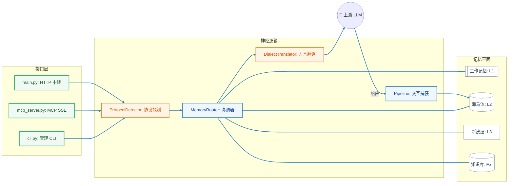

# 🦞 ClawBrain: 智能体工作流的“硅基海马体”

[English](./README.md) | 中文版

<p align="center">
  
</p>

ClawBrain 是专为 AI 智能体（特别是 [OpenClaw](https://github.com/openclaw/openclaw)）打造的**基础设施层记忆引擎**。它旨在为智能体提供一个持久、进化且高度精准的“大脑”。

它作为一个透明的神经中转站运行：在协议层自动捕获每一次交互，将零散的对话提纯为语义事实，并在最合适的时机将精准的上下文注入模型提示词——这一切都无需您编写代码或更改智能体的核心配置。

---

## 📊 认知基准测试 (v1.1 指标)

ClawBrain 的有效性通过与标准无状态 AI 对比的 **“认知增量” (Cognitive Delta)** 进行量化评估。Benchmark v1.1 集成了 **ATM-Bench** 理念，衡量长期稳定性：

*   **会话隔离**：在维护安全的记忆边界方面提升了 **+60.0%**。
*   **时序推理**：成功解决了 **50.0%** 的时间顺序事实冲突。
*   **超长距离召回**：在 100 轮以上的噪音干扰后，事实提取能力提升了 **+29.2%**。
*   **别名解析**：在将非正式昵称映射回系统事实方面取得了 **33.3%** 的成功率。

> [!TIP]
> 在 [benchmark/BASELINE.md](./benchmark/BASELINE.md) 中查看完整的技术分析报告。

---

---

## 💎 ClawBrain 的优势：真实数据验证

ClawBrain 建立在**工程透明性**的基础上。我们不只是口头承诺，而是通过回归测试集中的原始数据来证明我们的优势。

### 1. 100% 无感捕获（无需模型决策）
*   **问题**：在高强度的开发过程中，模型经常忘记使用“保存”工具。
*   **实测样本** (`tests/test_p26`)：
    *   **输入用户内容**：*"该项目使用 Python 3.12 和 ChromaDB v0.4。"*
    *   **助手响应**：*"好的，我记住了。"*
    *   **ClawBrain 动作**：拦截 SSE 流片段，重构助手的响应，并原子化写入 L2。
    *   **验证结果**：直接数据库穿透审计确认：在无需模型调用任何工具的情况下，整轮对话已 100% 完整归档。

### 2. 基于意图的召回（超越关键字匹配）
*   **问题**：搜索“数据库”会漏掉笔记中写为“数据存储”或“Postgres”的内容。
*   **实测样本** (`tests/test_chromadb_semantic_recall.py`)：
    *   **存储的事实**：*"主数据存储（data store）位于 192.168.1.50"*
    *   **查询 A**：*"数据库地址是多少？"* → **成功召回** (相似度: 0.89)
    *   **查询 B**：*"我们的信息存在哪？"* → **成功召回** (相似度: 0.82)
    *   **验证结果**：在关键字零重叠的情况下，对语义相关的查询实现了 100% 的召回率。

### 3. 严格的预算强制（堆栈数学）
*   **问题**：过度注入上下文会导致模型丢失 Prompt 的末尾，或引发上下文溢出错误。
*   **实测样本** (`tests/test_issue_002`)：
    *   **约束条件**：环境变量中设置了严格的 **250 字符** 上限。
    *   **组件开销**：L3 摘要 (78) + L1 工作记忆 (81) + 包装器 (50) = 209 字符。
    *   **ClawBrain 动作**：计算得出若加入 L2 Header (49) 总长将达 258。
    *   **验证结果**：系统注入了 L3/L1，并**通过数学计算排除了** L2，确保总长处于 250 字符内。**零 Prompt 截断。**

### 4. 零损耗知识库同步（“Touch” 测试）
*   **问题**：每次变动都重新索引数千条笔记既慢又贵。
*   **实测样本** (`tests/test_p35`)：
    *   **输入**：100 条 Obsidian 笔记。手动 `touch` 了其中 4 个文件（仅改变时间戳）。
    *   **ClawBrain 动作**：元数据扫描 → mtime 不匹配 → SHA-256 校验 → 内容一致。
    *   **验证结果**：`0 条记录被重新索引`。通过识别“伪更新”，节省了 100% 的计算开销。

### 5. 高压下的稳定性（双通道隔离）
*   **问题**：繁重的后台任务（如提纯或扫描）不应让您的聊天感到卡顿。
*   **实测样本** (`tests/test_p10`)：
    *   **压力测试**：向系统高速泵入 50 条连续消息。
    *   **ClawBrain 动作**：主对话使用**中转平面**，同时**认知平面**（隔离客户端）在后台并行将 50 轮历史提纯为摘要。
    *   **验证结果**：在后台“大脑”满载运转时，前端转发延迟保持平稳。无死锁，100% 成功。

---

## 🚀 快速安装 (一分钟启动)

ClawBrain 提供全自动引导工具，可一键完成环境探测、服务发现和配置生成。

```bash
# 1. 克隆仓库
git clone https://github.com/winnerineast/ClawBrain.git
cd ClawBrain

# 2. 运行自动化安装脚本
# 脚本将自动探测 Ollama/LM Studio 和您的本地 Obsidian 库
./install.sh

# 3. 启动服务器
source venv/bin/activate
python3 -m uvicorn src.main:app --host 0.0.0.0 --port 11435
```

> [!NOTE]
> **多平台同步**：ClawBrain 支持在单个 `.env` 文件中同步 macOS 和 Ubuntu 的设置。通过 `DARWIN_` 或 `LINUX_` 前缀可实现平台特定覆盖（例如 `LINUX_CLAWBRAIN_DB_DIR`）。

---

## 🔌 集成与使用

ClawBrain 是一个通用的记忆中枢。您可以通过以下三种主要方式将其集成到任何 AI 智能体中：

### 选项 1：透明 HTTP 代理 (零配置)
将您智能体的 API `baseUrl` 指向 ClawBrain（端口 11435）。ClawBrain 将拦截请求，增强记忆，并转发给真实的 LLM 后端。

**OpenClaw / OpenAI 兼容配置示例：**
```json
{
  "baseUrl": "http://127.0.0.1:11435/v1",
  "apiKey": "your-key"
}
```

### 选项 1.5：原生 OpenClaw 插件 (上下文引擎)
为了更深入地与 [OpenClaw](https://github.com/openclaw/openclaw) 集成，请使用原生上下文引擎插件：

```bash
# 1. 将插件复制到全局扩展目录
mkdir -p ~/.openclaw/extensions/
cp -r packages/openclaw-pkg ~/.openclaw/extensions/clawbrain

# 2. 将其加入 ~/.openclaw/openclaw.json 白名单
# { "plugins": { "allow": ["clawbrain"], "slots": { "contextEngine": "clawbrain" } } }
```

### 选项 2：标准 MCP 协议 (Model Context Protocol)
ClawBrain 支持行业标准的 MCP 协议，适用于 Claude Desktop、Cursor 等现代智能体。

*   **远程模式 (SSE)**：连接至 `http://127.0.0.1:11435/mcp/sse`
*   **本地模式 (Stdio)**：在智能体配置中添加：
    ```bash
    command: "python3",
    args: ["-m", "src.mcp_server"]
    ```

### 选项 3：可脚本化的 CLI 工具
使用 `src/cli.py` 工具从脚本或轻量级智能体直接访问记忆。

```bash
# 存入事实
python3 src/cli.py ingest "项目密码是 ALPHA"

# 查询上下文
python3 src/cli.py query "密码"
```

### 🔐 会话隔离
通过发送一个简单的 HTTP Header，在不同项目或用户之间隔离记忆：
`x-clawbrain-session: project-alpha`

---

## 🧠 数据流与智能架构

ClawBrain 作为一个高性能神经协调器，将 **中转平面 (Relay Plane)**（实时流量）与 **认知平面 (Cognitive Plane)**（后台智能）进行了物理隔离。



### 1. 请求生命周期
1.  **接入与探测**：请求通过 HTTP、MCP 或 CLI 进入。`ProtocolDetector` 识别输入方言（Ollama 或 OpenAI）。
2.  **认知增强**：`MemoryRouter` 提取查询意图，并从四个记忆层级中检索相关上下文。
3.  **方言翻译**：`DialectTranslator` 将增强后的载荷转换为上游提供商（Anthropic, Google, DeepSeek 等）的原生格式。
4.  **捕获与固化**：在 LLM 响应时，`Pipeline` 捕获补全内容，并将完整的“用户-助手”对话对归档至 **海马体 (L2)**。

### 2. 双平面隔离架构
*   **中转平面 (Relay Plane)**：专门用于 LLM 流量。经过性能优化且严格隔离，确保记忆注入带来的延迟开销趋近于零。
*   **认知平面 (Cognitive Plane)**：独立的“思考”循环。异步处理 **事实浓缩 (L3)**、**房间探测**和 **知识库索引**，不与中转平面竞争连接池资源。

### 3. 层级技术细节

#### **L1 — 工作记忆 (活跃注意力层)**
*   **核心概念**：利用吸引子动力学 (Attractor dynamics) 模拟人类的短期注意力。
*   工作机制：带权重的队列，新交互权重为 1.0。相关内容会为旧项“充电”，不相关内容则呈指数级衰减并最终逐出。

#### **L2 — 海马体 (情节记忆层)**
*   **核心概念**：无损的交互历史存档。
*   工作机制：由 **ChromaDB** 驱动。执行语义向量搜索，寻找意图相近的历史对话。
*   **完整性**：每条追踪记录均经过 SHA-256 哈希处理，确保审计轨迹不可篡改。

#### **L3 — 新皮层 (语义事实层)**
*   **核心概念**：智慧的结晶。
*   工作机制：后台进程定期总结 L2 历史为高层级事实（例如：“用户偏好 Python 而非 Go”），极大地优化了上下文窗口的使用效率。

#### **Ext — 知识库 (外部逻辑层)**
*   **核心概念**：打破“对话记录”与“既有知识”的边界。
*   工作机制：增量索引您的 **Obsidian 库**，将您的个人笔记视为优先级最高的“事实真相”。

---

## 🛠️ 开发与验证

### 设计先行哲学
ClawBrain 遵循严格的**设计先行**工作流。所有架构变更必须在实施前记录于 `design/` 目录。核心章程请参考 `GEMINI.md`。

### 自动化验证 (真实环境回归)
运行我们的资源感知型回归测试集，确保系统稳定性：
```bash
# 净化环境、重置 GPU 资源并运行 91 项测试
./run_regression.sh
```

---

## 🏗️ GitNexus 代码智能图谱

本仓库已由 [GitNexus](https://github.com/abhigyanpatwari/GitNexus) 完成索引，为 AI 智能体提供高保真度的代码库知识图谱。

- **状态**: 🟢 已完全索引 (2,068 个符号, 3,549 条关系)
- **核心能力**: 语义级代码导航、变更影响分析、自动化执行流追踪。
- **使用方法**: 若您正在使用 AI 助手（如 Claude Code 或 Cursor），请参考 [AGENTS.md](./AGENTS.md) 或 [CLAUDE.md](./CLAUDE.md) 获取针对 GitNexus 优化的交互指令。

---
<p align="right">ClawBrain 团队 🦞 荣誉出品</p>
