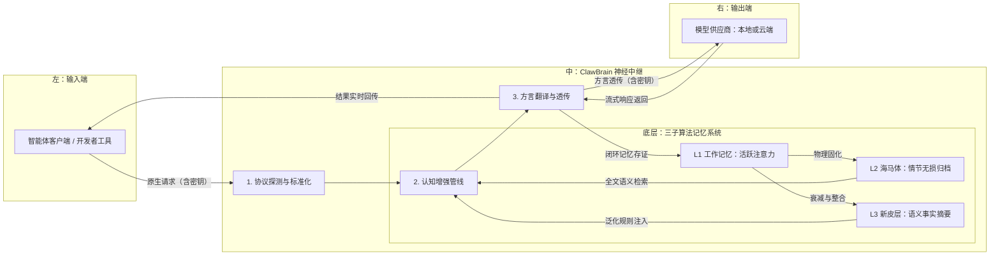

# 🦞 ClawBrain：智能体工作流的"硅基海马体"

[English](./README.md) | 中文版

<p align="center">
  
</p>

ClawBrain 是 **[OpenClaw](https://github.com/openclaw/openclaw) 的基础设施层记忆引擎**。它作为透明代理插入 OpenClaw 与 LLM 后端之间——自动捕获每一次交互、将其提纯为持久知识、并在恰当时机注入正确的上下文。无需修改 OpenClaw 的配置或代码。

---

## 既然 OpenClaw 已有记忆系统，为什么还需要 ClawBrain？

OpenClaw 自带了一套设计精良的记忆系统：`MEMORY.md` 存储长期事实，每日笔记文件存储近期上下文，FTS5 + 向量混合检索，以及实验性的 Dreaming 机制将短期记录提升为长期记忆。这套设计是认真的。

但存在四个结构性限制，ClawBrain 在基础设施层面解决了它们。

### 1. 记忆依赖模型主动决定去写

OpenClaw 的记忆是**按需写入**的——模型必须自己注意到某事值得记录、选择调用 `memory_write`、并准确措辞。在对话节奏快、上下文压力大或模型注意力分散时，这一步往往被跳过。重要的决策、用户偏好、已解决的问题就此悄然消失。

ClawBrain 在**网络层**自动捕获每一次交互，无需模型决策，没有任何遗漏。

### 2. `MEMORY.md` 每轮都注入上下文——而且会越来越大

OpenClaw 在每次会话开始时将 `MEMORY.md` 注入 system prompt。这个设计本身是合理的，但有一个持续累积的代价：文件越大，每轮消耗的 token 越多，触发 compaction 的频率越高，API 费用也随之上升。OpenClaw 自己的文档也警告：*"保持 MEMORY.md 简洁——它会随时间增长，可能导致 context 使用量意外激增。"*

ClawBrain 使用**贪心 context 预算**（L3 → L2 → L1，默认 2000 字符），只注入与当前查询相关的内容，而非整个记忆文件。完整的归档存储在 SQLite 中，按需检索。

### 3. 语义搜索依赖云端 Embedding API Key

OpenClaw 的向量搜索功能强大，但需要 OpenAI、Gemini、Voyage 或 Mistral 的 API key。没有 key 时，只有 FTS5 关键词搜索可用。对于完全本地化部署（Ollama、LM Studio）的用户，这意味着召回质量大幅下降。

ClawBrain 的两级 FTS5 搜索（精确短语 → 关键词 AND 降级）完全离线运行。不需要 Embedding API，不依赖云端，本地优先。

### 4. Dreaming 是实验性功能，默认关闭

OpenClaw 的 Dreaming 功能——将每日短期记录提升至 `MEMORY.md` 长期存储——默认禁用，需要手动配置，且标注为实验性。大多数用户从未启用它。

ClawBrain 的 Neocortex 提纯自动在后台运行。每 N 次交互，后台任务自动将近期记录整合为持久化的语义摘要——无需配置，始终开启。

---

## 两种集成模式

ClawBrain 提供两种接入 OpenClaw 的方式，可以选择其中一种，也可以同时运行。

| | 模式 A — HTTP 透明代理 | 模式 B — Context Engine 插件 |
|---|---|---|
| **原理** | 作为透明代理拦截 LLM 请求 | 原生 OpenClaw 插件，通过内部 API 集成 |
| **接入成本** | 改一个 URL | 安装插件 + 两行配置 |
| **记忆注入方式** | 以 `[IMPORTANT]` 系统消息注入每次请求 | 以 `systemPromptAddition` 在每次模型运行前注入 |
| **会话追踪** | 通过 `x-clawbrain-session` Header | 通过 OpenClaw 原生 `sessionId` |
| **兼容所有 LLM 后端** | 是 | 是 |
| **OpenClaw 原生生命周期钩子** | 否 | 是（`ingest/assemble/compact/afterTurn`） |

两种模式共用同一套三层记忆后端。模式 B 与 OpenClaw 会话生命周期结合更紧密。

---

## 🚀 快速启动（Docker）

```bash
git clone https://github.com/winnerineast/ClawBrain.git
cd ClawBrain
cp .env.example .env        # 按需配置环境变量
docker compose up -d        # 启动，监听端口 11435
curl http://localhost:11435/health
```

---

## 🔌 与 OpenClaw 集成

### 模式 A — HTTP 透明代理（零配置）

将 OpenClaw 的模型端点指向 ClawBrain，ClawBrain 自动拦截每次请求、注入记忆、转发给真实后端。

```
OpenClaw  →  ClawBrain（端口 11435）  →  Ollama / OpenAI / Claude / Gemini
                    │
         ┌──────────┴──────────┐
         │    每次请求时       │
         │  1. 归档交互轨迹   │  ← 自动捕获，无需模型决策
         │  2. 检索相关记忆   │  ← FTS5 召回，按 session 隔离
         │  3. 注入上下文     │  ← 贪心预算，高价值事实优先
         └─────────────────────┘
```

在 OpenClaw 的 provider 配置中，把 `baseUrl` 改为 ClawBrain 地址：

```json
"ollama": {
  "baseUrl": "http://127.0.0.1:11435",
  "apiKey": "sk-xxx..."
}
```

设置 session header，使记忆按用户/项目隔离：

```
x-clawbrain-session: my-project
```

完成。无需其他配置。

---

### 模式 B — Context Engine 插件（OpenClaw 原生）

ClawBrain 实现了 OpenClaw 的 [Context Engine 插件接口](https://github.com/openclaw/openclaw)。
OpenClaw 直接调用 ClawBrain 的 `ingest/assemble/compact/afterTurn` 生命周期钩子，
ClawBrain 精准控制注入内容和注入时机。

**第一步 — 启动 ClawBrain**

```bash
docker compose up -d
# 或本地运行：
PYTHONPATH=. uvicorn src.main:app --host 0.0.0.0 --port 11435
```

**第二步 — 安装插件**

```bash
# 从本地克隆安装：
openclaw plugins install -l ./packages/openclaw

# 如果 dist/ 不存在，先构建：
cd packages/openclaw && npm install && npm run build
cd ../..
openclaw plugins install -l ./packages/openclaw
```

**第三步 — 配置 `~/.openclaw/openclaw.json`**

```json5
{
  plugins: {
    slots: {
      contextEngine: "clawbrain"   // ClawBrain 接管上下文组装与 compaction
    },
    entries: {
      clawbrain: {
        enabled: true,
        // 可选覆盖：
        // config: { url: "http://localhost:11435" }
      }
    },
    load: {
      paths: ["./packages/openclaw/dist/index.js"]
    }
  }
}
```

**第四步 — 重启 OpenClaw gateway**

```bash
openclaw restart
```

**验证插件已激活：**

```bash
openclaw doctor
# 应显示：contextEngine → clawbrain
```

#### 激活后的行为

| 钩子 | OpenClaw 调用时机 | ClawBrain 的操作 |
|------|------------------|-----------------|
| `ingest` | 每条新消息到达时 | 归档至海马体，更新工作记忆 |
| `assemble` | 每次模型运行前 | 检索 L3→L2→L1 上下文，以 `systemPromptAddition` 注入 |
| `compact` | 上下文窗口满 / 执行 `/compact` 时 | 将轨迹提纯至新皮层，裁剪工作记忆 |
| `afterTurn` | 模型运行结束后 | 持久化 WM 快照，可选触发后台提纯 |

ClawBrain 设置 `ownsCompaction: true`——OpenClaw 内置的自动 compaction 被禁用，
由 ClawBrain 的 SQLite 提纯机制接管。

#### 插件环境变量

| 变量 | 默认值 | 说明 |
|------|--------|------|
| `CLAWBRAIN_URL` | `http://localhost:11435` | ClawBrain 服务地址（插件读取） |
| `CLAWBRAIN_TIMEOUT_MS` | `5000` | 单次请求超时（毫秒） |

---

### 两种模式同时运行

两种模式完全独立。可以同时运行 HTTP 透明代理处理通用 LLM 流量，
并启用 Context Engine 插件处理 OpenClaw 会话——共享同一个服务器和同一套记忆存储。

---

## 🏗️ 全景架构：信息流与记忆演变



---

## 🧠 深度设计哲学：三子记忆的演变算法

### L1 — 工作记忆（活跃注意力层）
- **工程实现**：内存中带权重的有序字典，**按 session 严格隔离**
- **吸引子动力学**：新输入为相关旧记忆重新充电（权重 → 1.0）；无关项指数衰减，低于 0.3 阈值时自动逐出
- **Session 隔离**：每个 `x-clawbrain-session` Header 值拥有独立的 WM 实例，跨会话泄漏在架构层面不可能发生

### L2 — 海马体（情节归档层）
- **工程实现**：SQLite FTS5 全文索引 + 本地 Blob 存储，**按 session 过滤**
- **两级搜索降级**：先精确短语匹配；无结果则降级为关键词 AND 模式
- **动态分流**：负载 > 512 KB 的内容流式写入 `data/blobs/`，索引保留锚点
- **完整性审计**：每条记录绑定 SHA-256 校验和，历史不可篡改、100% 可回溯
- **自动清理**：启动时清除 `timestamp=0.0` 脏数据、TTL 过期记录及孤儿 blob 文件

### L3 — 新皮层（语义事实层）
- **工程实现**：基于 LLM 的后台异步语义提纯引擎
- **触发时机**：当海马体积累 `distill_threshold` 条记录（默认 50）时，后台任务自动将碎片提纯为持久化的事实摘要
- **推荐公式**：`distill_threshold ≈ (ContextWindow / 平均记录大小) × 0.8`
- **上下文预算**：贪心策略 L3 → L2 → L1 优先分配，总字符数上限由 `CLAWBRAIN_MAX_CONTEXT_CHARS` 控制

---

## 🔄 协议翻译与模型适配

ClawBrain 内置万能方言翻译器，自动处理各提供商的 API 差异：

| 类别 | 支持的平台 |
|------|-----------|
| **本地** | Ollama、LM Studio、vLLM、SGLang |
| **云端** | OpenAI、DeepSeek、Anthropic（Claude）、Google（Gemini）、xAI（Grok）、Mistral、OpenRouter |

自动处理：角色合并（Anthropic）、角色映射（Gemini）、非破坏性模型前缀剥离、小模型 Tool Call 准入拦截。

---

## 🔐 Session 隔离

每个请求通过单一 HTTP Header 绑定会话：

```
x-clawbrain-session: alice
```

- 工作记忆（L1）、海马体检索（L2）和上下文组装全链路按 session 隔离
- 无 Header 时流量归入 `"default"` session，日志输出警告
- Session 状态通过海马体水化（Hydrate）在服务重启后自动恢复

---

## 🛠️ 管理 API

```bash
# 查询指定 session 的记忆状态
GET /v1/memory/{session_id}

# 清除指定 session 的新皮层摘要
DELETE /v1/memory/{session_id}

# 手动触发指定 session 的异步提纯任务
POST /v1/memory/{session_id}/distill

# 健康检查
GET /health
```

---

## ⚙️ 配置项一览

所有运行时参数通过环境变量注入（配置于 `.env` 文件）：

| 变量名 | 默认值 | 说明 |
|--------|--------|------|
| `CLAWBRAIN_DB_DIR` | `/app/data` | SQLite DB 与 blobs 目录 |
| `CLAWBRAIN_MAX_CONTEXT_CHARS` | `2000` | 每次请求注入的上下文字符总上限 |
| `CLAWBRAIN_TRACE_TTL_DAYS` | `30` | 记录过期天数（`0` = 禁用）|
| `CLAWBRAIN_EXTRA_PROVIDERS` | _（空）_ | JSON 字符串，运行时动态注入额外 Provider |
| `CLAWBRAIN_LOCAL_MODELS` | _（空）_ | JSON 字符串，追加本地模型白名单 |

**动态注入 Provider 示例：**
```bash
CLAWBRAIN_EXTRA_PROVIDERS='{"myprovider": {"base_url": "http://192.168.1.10:8080", "protocol": "openai"}}'
```

---

## 🐳 Docker 部署

```bash
docker compose up -d          # 启动
docker compose logs -f        # 实时日志
docker compose down           # 停止（数据持久化在 ./data）
```

`./data` 目录通过 Volume 挂载——SQLite DB 与 blob 文件在容器重启和升级后均不丢失。

> **注意**：ClawBrain 默认以 `--workers 1` 单进程运行。工作记忆（L1）存于进程内存，水平扩展需将 L1 迁移至外部存储（如 Redis）。

---

## 🖥️ 本地开发

```bash
python3 -m venv venv && source venv/bin/activate
pip install -r requirements.txt
# 使用 PYTHONPATH=. 启动以确保能找到本地模块
PYTHONPATH=. ./venv/bin/python3 -m uvicorn src.main:app --host 0.0.0.0 --port 11435 --reload

# 运行完整测试套件
PYTHONPATH=. ./venv/bin/pytest tests/ --ignore=tests/test_p10_auto_trigger.py -v
```

> `test_p10_auto_trigger.py` 需要本地 Ollama 运行以执行提纯——在无本地模型的 CI 环境中可跳过。

---

## 🛡️ 隐私与安全承诺

ClawBrain 遵循**"无影准则"**：
- **零记录政策**：系统核心逻辑严禁记录、保存或持久化任何 API 密钥或鉴权凭证
- **透明透传架构**：所有身份验证信息仅在内存中瞬时中转，请求处理完成即销毁
- **本地化存储**：所有记忆产物（海马体情节记录、新皮层语义事实）完全存储在本地 `data/` 目录，绝不上传至任何第三方云端

---

## 🧪 审计哲学

项目遵循 **GEMINI.md** 宪法：代码变更前先更新设计文档，每个 Phase 在 `results/` 留存 Side-by-Side 审计证据。

运行时结构化日志标签：

| 标签 | 层级 |
|------|------|
| `[DETECTOR]` | 协议探测 |
| `[PIPELINE]` | 认知管线 |
| `[MODEL_QUAL]` | 模型分级与 Tool Call 准入 |
| `[HP_STOR]` | 海马体落盘 |
| `[HP_CLEAN]` | TTL / 脏数据清理 |
| `[CTX_BUDGET]` | L3→L2→L1 预算分配 |
| `[NC_DIST]` | 新皮层提纯 |
| `[SESSION]` | Session Header 警告 |

---

<p align="right">由 Claude Sonnet 4.6 依据源码 v1.40（P24）生成</p>
