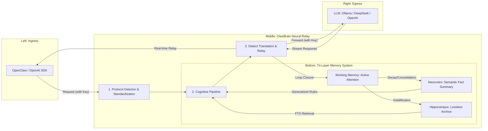

# 🦞 ClawBrain: The Silicon Hippocampus for your Agentic Workflow

English | [中文版](./README.md)

<p align="center">
  
</p>

ClawBrain is a biomimetically designed **Transparent Neural Relay Gateway**. It enables advanced memory algorithms to achieve high-ratio context distillation and long-term episodic recall, even in VRAM-constrained environments.

---

## 🛡️ Privacy & Security Commitment
**ClawBrain adheres to the "No-Shadow Principle":**
- **Zero-Knowledge**: The system **never records, saves, or persists** any of your `API Keys` or authentication credentials.
- **Transparent Relay**: All credentials are held only in volatile memory for instantaneous forwarding and are destroyed immediately after the request completion.
- **Local First**: All memory artifacts (Hippocampus/Neocortex) are stored in your local SQLite database and are never uploaded to any cloud service.

---

## 🏗️ System Architecture: The Neural Lifecycle

The system utilizes a horizontal flow design, anchored by a tri-layer dynamic memory engine:



---

## 🧠 Design Philosophy: Tri-Layer Implementation
Inspired by "Uncle Xia's Theory," functionally implemented via:

### 1. Hippocampus (Episodic Memory Layer)
*   **Implementation**: `src/memory/storage.py` (SQLite FTS5 + Blob Storage)
*   **Feature**: The system's "lossless black box." 100% of raw bytes recorded to disk. Supports 10MB+ stream offloading and sub-millisecond full-text search with SHA-256 integrity audits.

### 2. Neocortex (Semantic Memory Layer)
*   **Implementation**: `src/memory/neocortex.py` (Asynchronous Distillation)
*   **Feature**: The system's "knowledge pool." Uses async background workers to call lightweight LLMs, generalizing episodic data into concise bullet-point fact lists that persist at the context edge.

### 3. Working Memory (Active Attention Layer)
*   **Implementation**: `src/memory/working.py` (Weighted OrderedDict)
*   **Feature**: The system's "instant focus." Calculates "Activation" scores based on **Temporal Proximity** and **Thematic Relevance**, ensuring attention is always on the most relevant context.

---

## 🔄 Supported Hosting
- **Local**: Ollama (Default), LM Studio, vLLM, SGLang.
- **Cloud**: OpenAI, DeepSeek, Anthropic, OpenRouter.

## ⚙️ Transparent Mounting
Simply point your `baseUrl` to **`11435`**; no redundant key configuration needed:

```json
"models": {
  "providers": {
    "ollama": {
      "baseUrl": "http://127.0.0.1:11435", 
      "apiKey": "sk-xxx..." // Credentials are forwarded transparently
    }
  }
}
```

---

## 🧪 Deterministic Audit
Adheres to **GEMINI.md**, providing Side-by-Side evidence for every logical transformation.

```bash
# Run full acceptance tests
export PYTHONPATH=$PYTHONPATH:.
pytest tests/
```

---
<p align="right">Generated by GEMINI CLI Agent based on Source Code v1.25</p>
