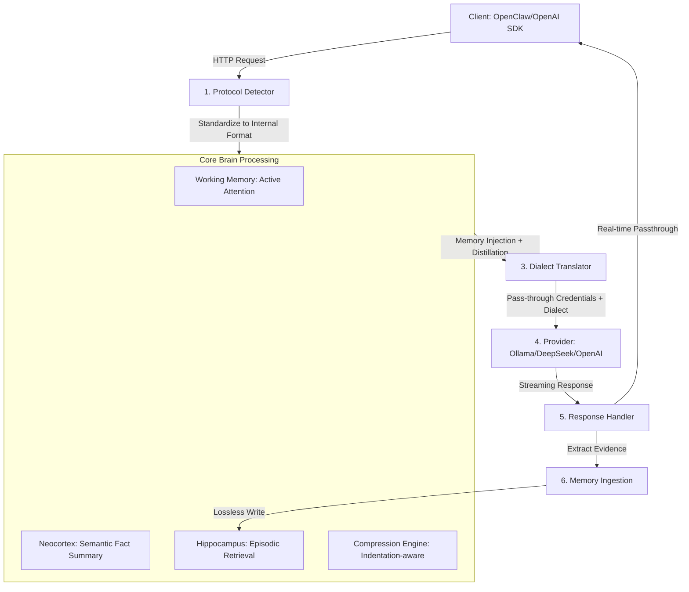

# 🦞 ClawBrain: The Silicon Hippocampus for your Agentic Workflow

English | [中文版](./README.md)

<p align="center">
  
</p>

ClawBrain is a biomimetically designed **Transparent Neural Relay Gateway**. It goes beyond protocol conversion by acting as an "External Brain" for LLMs. By funneling every interaction through the "Hippocampus" and "Neocortex," it empowers standard models with long-term memory and precise execution capabilities that transcend original context limits.

---

## 🏗️ System Architecture: The Neural Lifecycle

The core of ClawBrain is a highly decoupled pipeline ensuring every request undergoes deep cognitive enhancement:



---

## 🧠 Deep Design Concepts

### 1. Dynamic Protocol Ingress
The system no longer requires manual protocol selection. The gateway automatically determines if the source is **Ollama Native** or **OpenAI Compatible** based on request paths (`/api` vs `/v1`) and structural fingerprints.

### 2. Cognitive Pipeline
Before forwarding to the model, ClawBrain executes a tri-factor enhancement:
- **Memory Synthesis**: Dynamically concatenates the current query with episodic history and generalized knowledge.
- **Activation Dynamics**: Based on "Temporal" and "Thematic" factors, relevant history automatically surfaces to the top of the context.
- **Physical Distillation**: Eliminates 15%+ of textual noise while strictly preserving code block (` ``` `) indentation.

### 3. Transparent Dialect Translation
The key to being a "Universal Interface." The gateway translates standardized requests into provider-specific (e.g., Anthropic or DeepSeek) JSON structures and handles **bidirectional streaming conversion between NDJSON and SSE**.

---

## ⚙️ Mounting Guide: Zero-Config Pass-through

ClawBrain utilizes a **"Credential Straight-through"** architecture. No API keys are stored on the gateway side.

### Client Integration (e.g., OpenClaw)
Simply point your `baseUrl` to ClawBrain; keep all other settings (including the real sk-key) unchanged:

```json
"ollama": {
  "baseUrl": "http://127.0.0.1:11435", // Route to Neural Gateway
  "api": "ollama",
  "apiKey": "sk-xxx..." // Credentials are transparently forwarded
}
```

### Model Routing Prefixes
Dynamically select backends via model name prefixes:
- `ollama/gemma4` $\rightarrow$ Routes to local 11434.
- `lmstudio/llama3` $\rightarrow$ Routes to local 1234.
- `openai/gpt-4o` $\rightarrow$ Routes to api.openai.com.

---

## 🧪 Deterministic Audit
Adheres to the **GEMINI.md** constitution. All E2E tests provide Side-by-Side evidence.

```bash
# Run full integration acceptance
pytest tests/test_p11_integration.py
```

---
<p align="right">Driven by GEMINI CLI Agent v1.25</p>
