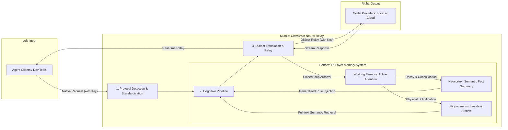

# 🦞 ClawBrain: The Silicon Hippocampus for your Agentic Workflow

English | [中文版](./README.md)

<p align="center">
  
</p>

ClawBrain is a biomimetically designed **Transparent Neural Relay Gateway**. It goes beyond solving multi-protocol routing by simulating the evolutionary logic of human memory, providing Large Language Models (LLMs) with an "External Brain" capable of self-evolution and tri-layer memory synergy. In VRAM-constrained environments, ClawBrain significantly boosts agentic context efficiency and logical consistency.

---

## 🛡️ Privacy & Security Commitment
**ClawBrain adheres to the "No-Shadow Principle" to protect your core digital assets:**
- **Zero-Knowledge Policy**: The system core logic is **strictly prohibited** from recording, saving, or persisting any of your API keys or authentication credentials.
- **Transparent Relay Architecture**: All authentication info is held only in volatile memory for instantaneous transit and is destroyed immediately upon request completion.
- **Localized Storage**: All memory artifacts (Episodic records in the Hippocampus, Semantic facts in the Neocortex) are stored exclusively in your local database and are never uploaded to any third-party clouds.

---

## 🏗️ System Architecture: The Neural Lifecycle

The system utilizes a horizontal flow design, anchored by a tri-layer deep dynamic memory engine ensuring every interaction is neurally enhanced:



---

## 🧠 Design Philosophy: Tri-Layer Memory Dynamics

ClawBrain's core is not a static database but a process of **"Phase Transitions"** as information flows between energy levels. Every interaction pair (Stimulus-Reaction) evolves from instant activation to long-term solidification:

### 1. Working Memory (L1: Active Attention Layer)
*   **Implementation**: In-memory Weighted OrderedDict.
*   **Evolutionary Logic**:
    - **Initial Activation**: Every new interaction pair enters with full charge (Weight = 1.0).
    - **Attractor Dynamics**: The system continuously scans the current focus. If new input is highly relevant to old memories, those memories are "re-charged," remaining in the attention center longer.
    - **Natural Decay**: Irrelevant info decays exponentially. When the weight drops below the 0.3 threshold, info vanishes from "instant consciousness" and its index is pushed to the Neocortex for generalization.

### 2. Hippocampus (L2: Episodic Archival Layer)
*   **Implementation**: SQLite Full-text Search (FTS5) and Local Blob Storage.
*   **Evolutionary Logic**:
    - **Digital Negative**: The system records 100% of raw bytes from every dialogue.
    - **Impact Defense**: For massive data (e.g., 10MB contracts or logs), the Hippocampus triggers stream offloading to keep RAM stable while precisely marking memory anchors in the index.
    - **Integrity Audit**: Every episodic memory is bound to a SHA-256 checksum, ensuring history is tamper-proof and 100% traceable.

### 3. Neocortex (L3: Semantic Fact Layer)
*   **Implementation**: Asynchronous Distillation Engine.
*   **Core Parameter: Consolidation Epoch (`distill_threshold`)**:
    - **Physical Meaning**: This parameter defines the tipping point where "episodic trivia" is transformed into "core knowledge." It represents the amount of redundant information the system tolerates before performing a costly logical abstraction.
    - **Self-Evolution**: Once the number of dialogue turns in the Hippocampus reaches this threshold, a background task is automatically triggered to generalize fragments into solidified fact lists.
    - **Recommended Algorithm**: This value should be inversely correlated with the model's **Context Window**.
        - **Formula**: `distill_threshold ≈ (ContextWindow / AverageTraceSize) * 0.8`
        - **Example**: For a 64k window model, a setting of **50** is recommended. For an 8k window, it should be set to **5-10** to trigger more frequent "flushing and purification."
*   **Evolutionary Logic**:
    - **Async Distillation**: Background tasks trigger once episodic trivia reaches a threshold.
    - **Generalized Extraction**: Leveraging the model's slow-accumulation effect, repetitive technical decisions or user preferences are distilled into "Fact Checklists."
    - **Long-term Persistence**: Distilled knowledge persists at the edges of the model context in a minimal format, providing cross-cycle logical guidance and eliminating model "amnesia."

---

## 🔄 Protocol Translation & Model Adaptation
ClawBrain features a universal dialect translator that automatically aligns with provider API contracts for 100% compatibility:
- **Local**: Deeply optimized for Ollama, LM Studio, vLLM, SGLang.
- **Cloud**: Supports OpenAI, DeepSeek, Anthropic (Claude 3.5), Google (Gemini), xAI (Grok), Mistral, and more.
- **Auto-Alignment**: Handles role merging (for Claude), role mapping (for Gemini), and automatic model prefix stripping.

---

## ⚙️ Mounting Guide: Zero-Config Pass-through
Simply point your client to local port **`11435`**; no redundant gateway configuration needed:

```json
"ollama": {
  "baseUrl": "http://127.0.0.1:11435", 
  "apiKey": "sk-xxx..." // Your original key is transparently forwarded
}
```

---

## 🧪 Deterministic Audit
Adheres to **GEMINI.md**, providing Side-by-Side evidence for every logical transformation.

```bash
# Run full acceptance tests
export PYTHONPATH=$PYTHONPATH:.
pytest tests/
```

---
<p align="right">Generated by GEMINI CLI Agent based on Source Code v1.26</p>
